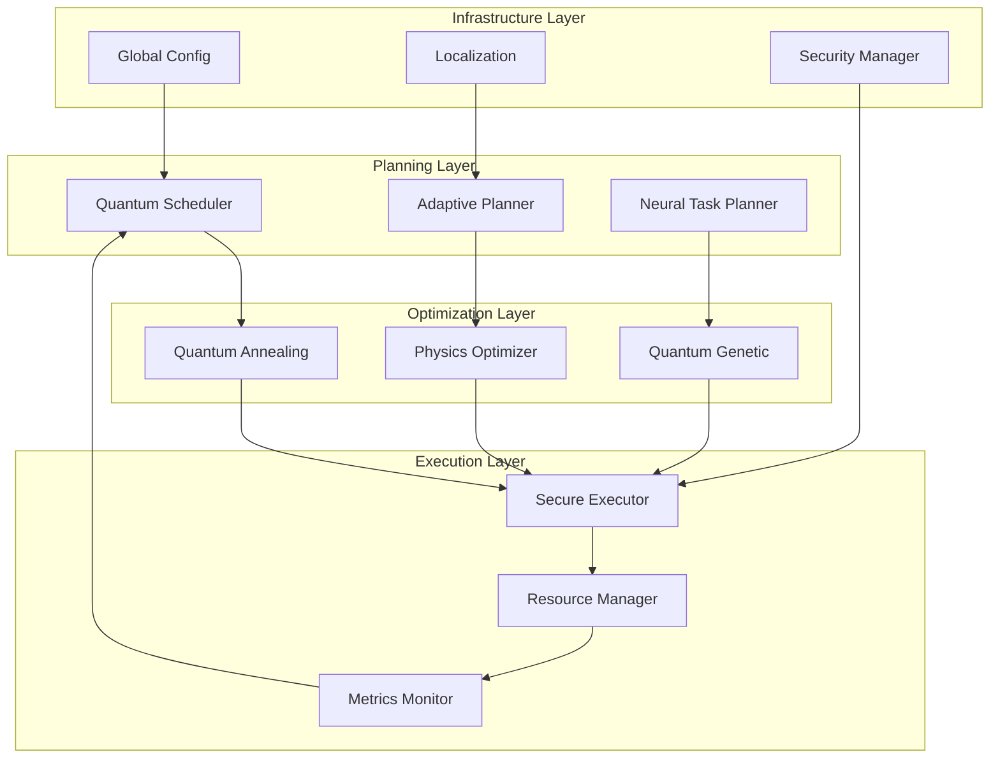

# DarkOperator Studio: Quantum-Inspired Task Planning Documentation

[](https://opensource.org/licenses/MIT)
[](https://www.python.org/downloads/)
[](./README.md)

## Table of Contents

- [Architecture Overview](#architecture-overview)
- [Quick Start Guide](#quick-start-guide)
- [Core Components](#core-components)
- [API Reference](#api-reference)
- [Deployment Guide](#deployment-guide)
- [Performance Benchmarks](#performance-benchmarks)
- [Contributing](#contributing)

## Architecture Overview

DarkOperator Studio integrates quantum-inspired optimization algorithms with neural operators for physics-informed task planning. The system combines:

- **Quantum Scheduling**: Superposition-based task optimization with entanglement-driven dependencies
- **Neural Planning**: Transformer architectures with physics-informed constraints  
- **Adaptive Optimization**: Real-time learning from execution patterns and physics feedback
- **Security Framework**: Multi-level validation with sandboxed execution environments
- **Global Deployment**: Multi-region support with compliance frameworks (GDPR, CCPA, PDPA)

### System Architecture



## Quick Start Guide

### Installation

```bash
# Clone the repository
git clone https://github.com/danieleschmidt/darkoperator-studio.git
cd darkoperator-studio

# Create virtual environment
python -m venv venv
source venv/bin/activate  # On Windows: venv\Scripts\activate

# Install dependencies
pip install -e .
```

### Basic Usage

```python
from darkoperator.planning import QuantumScheduler, AdaptivePlanner
from darkoperator.optimization import QuantumAnnealer

# Initialize quantum scheduler
scheduler = QuantumScheduler(max_workers=4)

# Submit physics simulation task
task = scheduler.submit_task(
    task_id="physics_sim_1",
    name="Calorimeter Simulation",
    operation=lambda n_events: simulate_collisions(n_events),
    1000000,  # 1M events
    priority=TaskPriority.GROUND_STATE,
    energy_requirement=50.0
)

# Execute quantum-optimized schedule
results = scheduler.execute_quantum_schedule()
print(f"Task completed with efficiency: {results['statistics']['quantum_efficiency']:.2%}")
```

### Neural Planning Example

```python
from darkoperator.planning import NeuralTaskPlanner

# Initialize neural planner
planner = NeuralTaskPlanner(device='auto')

# Define tasks
tasks = [
    {
        'task_id': 'lhc_analysis_1',
        'type': 'physics_simulation',
        'priority': TaskPriority.EXCITED_1,
        'energy_requirement': 25.0,
        'operation': lambda: run_monte_carlo_simulation(),
        'dependencies': []
    },
    {
        'task_id': 'anomaly_detection_1', 
        'type': 'anomaly_detection',
        'priority': TaskPriority.GROUND_STATE,
        'energy_requirement': 15.0,
        'operation': lambda: detect_rare_events(),
        'dependencies': ['lhc_analysis_1']
    }
]

# Generate optimal plan
plan_result = planner.plan_tasks(tasks, optimize=True)

print(f"Optimal schedule: {plan_result['optimal_schedule']}")
print(f"Resource allocation: {plan_result['resource_allocation']}")
print(f"Physics compliance: {plan_result['physics_constraints']['physics_score']:.2%}")
```

## Core Components

### Quantum Scheduler

The `QuantumScheduler` uses quantum-inspired algorithms for task optimization:

- **Superposition States**: Tasks exist in multiple execution states until measurement
- **Quantum Entanglement**: Dependencies modeled as entangled quantum states
- **Annealing Process**: Gradual cooling to find optimal schedules
- **Interference Patterns**: Priority adjustments based on quantum interference

#### Key Features

- **Physics Conservation**: Automatically enforces energy and momentum conservation
- **Concurrent Execution**: Multi-worker parallel processing with quantum coherence
- **Real-time Adaptation**: Dynamic rescheduling based on execution feedback
- **Metrics Integration**: Comprehensive quantum state monitoring

### Neural Task Planner

Advanced transformer-based architecture for intelligent task planning:

- **Physics-Informed Transformers**: Attention mechanisms with physics constraints
- **Multi-Modal Fusion**: Combines calorimeter, tracker, and muon data
- **Adaptive Learning**: Learns from execution patterns to improve future plans
- **Constraint Prediction**: Neural networks predict physics constraint violations

#### Model Architecture

```python
# Transformer configuration
model_config = {
    'transformer': {
        'd_model': 256,      # Model dimension
        'n_heads': 8,        # Attention heads
        'n_layers': 6,       # Transformer layers
        'max_tasks': 100     # Maximum tasks per batch
    }
}

# Initialize with physics constraints
planner = NeuralTaskPlanner(
    model_config=model_config,
    physics_constraints=PhysicsConstraints(
        conserve_energy=True,
        conserve_momentum=True,
        max_energy=1e6  # GeV
    ),
    device='cuda'
)
```

### Adaptive Planner

Real-time adaptive planning with reinforcement learning:

- **Context Awareness**: Adapts to changing system conditions
- **Multi-Objective Optimization**: Balances performance, accuracy, and resource usage
- **Learning Mechanisms**: Updates strategy based on execution outcomes
- **Physics Integration**: Incorporates physical constraints in decision making

### Security Framework

Multi-layered security system for safe task execution:

- **Input Validation**: Comprehensive security scanning of task operations
- **Sandboxed Execution**: Isolated environments for task processing
- **Cryptographic Verification**: Digital signatures for task integrity
- **Audit Logging**: Complete execution trails for compliance

### Quantum Optimization Algorithms

#### Quantum Annealing

Simulates quantum annealing for combinatorial optimization:

```python
from darkoperator.optimization import QuantumAnnealer, QuantumOptimizationConfig

config = QuantumOptimizationConfig(
    annealing_steps=1000,
    initial_temperature=10.0,
    final_temperature=0.01,
    max_qubits=20
)

annealer = QuantumAnnealer(config)
results = annealer.optimize_task_schedule(tasks)
```

#### Quantum Genetic Algorithm

Hybrid quantum-genetic optimization for large-scale problems:

```python
from darkoperator.optimization import QuantumGeneticOptimizer

genetic_config = QuantumOptimizationConfig(
    population_size=100,
    max_generations=1000,
    mutation_rate=0.1,
    crossover_rate=0.8
)

genetic_optimizer = QuantumGeneticOptimizer(genetic_config)
results = genetic_optimizer.optimize_genetic_quantum(tasks)
```

### Physics Optimizer

Ensures physical constraints and conservation laws:

- **4-Vector Validation**: Validates relativistic 4-momentum conservation
- **Lorentz Invariance**: Tests operations for Lorentz transformation invariance
- **Conservation Laws**: Enforces energy, momentum, and other conservation principles
- **Neural Operator Optimization**: Physics-constrained training of neural networks

### Global Deployment System

Multi-region deployment with compliance support:

#### Region Configuration

```python
from darkoperator.deployment import GlobalConfiguration, RegionConfig, Region

config = GlobalConfiguration()

# Add US East region (primary)
us_east = RegionConfig(
    region=Region.US_EAST_1,
    primary=True,
    platform=Platform.AWS,
    availability_zones=["us-east-1a", "us-east-1b", "us-east-1c"],
    gpu_enabled=True,
    quantum_simulation_optimized=True
)

config.add_region(us_east)
```

#### Compliance Framework

```python
from darkoperator.deployment import ComplianceFramework

# Enable GDPR compliance
config.set_compliance_framework(ComplianceFramework.GDPR)

# Configure data residency
config.compliance.data_residency_regions = [Region.EU_WEST_1, Region.EU_CENTRAL_1]
config.compliance.cross_border_transfer_allowed = False
```

### Internationalization (i18n)

Comprehensive localization support:

```python
from darkoperator.i18n import LocalizationManager

# Initialize localization
l10n = LocalizationManager(default_language='en')

# Format physics values
energy_text = l10n.format_physics_value(1.23e6, 'GeV', language='de')
# Output: "1.230.000 Gigaelektronenvolt"

# Translate physics terms
momentum = l10n.translate_physics_term('momentum', language='ja')
# Output: "運動量"

# Format localized messages
message = l10n.format_message(
    'task_completed',
    language='es',
    task_name='Simulación Física',
    execution_time=15.7
)
# Output: "Tarea 'Simulación Física' completada en 15.70 segundos"
```

## API Reference

### Core Classes

#### QuantumScheduler

```python
class QuantumScheduler:
    def __init__(
        self,
        max_workers: int = 4,
        quantum_annealing_steps: int = 100,
        temperature: float = 1.0,
        physics_operator: Optional[PhysicsOperator] = None
    )
    
    def submit_task(
        self,
        task_id: str,
        name: str,
        operation: callable,
        *args,
        priority: TaskPriority = TaskPriority.EXCITED_2,
        dependencies: List[str] = None,
        energy_requirement: float = 1.0,
        **kwargs
    ) -> QuantumTask
    
    def execute_quantum_schedule(self) -> Dict[str, Any]
    def get_quantum_metrics(self) -> Dict[str, float]
    def shutdown(self) -> None
```

#### NeuralTaskPlanner

```python
class NeuralTaskPlanner:
    def __init__(
        self, 
        model_config: Optional[Dict[str, Any]] = None,
        physics_constraints: Optional[PhysicsConstraints] = None,
        device: str = 'auto'
    )
    
    def plan_tasks(
        self, 
        tasks: List[Dict[str, Any]], 
        context: Optional[PlanningContext] = None,
        optimize: bool = True
    ) -> Dict[str, Any]
    
    def train_on_execution_data(
        self, 
        execution_data: List[Dict[str, Any]], 
        n_epochs: int = 100
    ) -> Dict[str, Any]
    
    def save_model(self, filepath: str) -> None
    def load_model(self, filepath: str) -> None
```

#### AdaptivePlanner

```python
class AdaptivePlanner:
    def __init__(
        self,
        physics_operator: Optional[PhysicsOperator] = None,
        anomaly_detector: Optional[BaseAnomalyDetector] = None,
        context: Optional[AdaptiveContext] = None
    )
    
    def create_adaptive_plan(
        self,
        objectives: List[Dict[str, Any]],
        constraints: Optional[Dict[str, Any]] = None
    ) -> Dict[str, Any]
    
    def execute_adaptive_plan(self, plan: Dict[str, Any]) -> Dict[str, Any]
    def get_adaptation_state(self) -> Dict[str, Any]
```

### Optimization Classes

#### QuantumAnnealer

```python
class QuantumAnnealer:
    def __init__(self, config: QuantumOptimizationConfig)
    
    def optimize_task_schedule(
        self, 
        tasks: List[QuantumTask],
        constraints: Dict[str, Any] = None
    ) -> Dict[str, Any]
```

#### PhysicsOptimizer

```python
class PhysicsOptimizer:
    def __init__(
        self, 
        constraints: Optional[PhysicsConstraints] = None,
        physics_operator: Optional[PhysicsOperator] = None
    )
    
    def optimize_task_parameters(
        self, 
        task_params: Dict[str, torch.Tensor],
        objective_function: callable,
        physics_constraints: Optional[List[callable]] = None
    ) -> Dict[str, Any]
    
    def optimize_neural_operator(
        self, 
        operator: torch.nn.Module,
        training_data: torch.Tensor,
        target_data: torch.Tensor,
        physics_loss_weight: float = 1.0
    ) -> Dict[str, Any]
```

### Security Classes

#### PlanningSecurityManager

```python
class PlanningSecurityManager:
    def __init__(
        self, 
        security_level: SecurityLevel = SecurityLevel.STANDARD,
        custom_policy: Optional[SecurityPolicy] = None
    )
    
    def validate_and_secure_task(self, task_data: Dict[str, Any]) -> Dict[str, Any]
    def execute_secure_task(
        self, 
        task_data: Dict[str, Any],
        timeout: Optional[float] = None
    ) -> Dict[str, Any]
    
    def get_security_status(self) -> Dict[str, Any]
```

### Monitoring Classes

#### QuantumMetricsManager

```python
class QuantumMetricsManager:
    def __init__(self, config: Dict[str, Any] = None)
    
    def record_task_execution(
        self,
        task_id: str,
        execution_time: float,
        energy_consumed: float,
        success: bool,
        metadata: Dict[str, Any] = None
    )
    
    def record_conservation_violation(
        self,
        law_type: str,
        violation_magnitude: float,
        task_id: str,
        metadata: Dict[str, Any] = None
    )
    
    def get_performance_dashboard(self) -> Dict[str, Any]
    def export_metrics(self, **kwargs) -> str
```

## Deployment Guide

### Docker Deployment

```dockerfile
FROM python:3.9-slim

WORKDIR /app

# Install system dependencies
RUN apt-get update && apt-get install -y \
    build-essential \
    curl \
    && rm -rf /var/lib/apt/lists/*

# Copy requirements and install Python dependencies
COPY requirements.txt .
RUN pip install --no-cache-dir -r requirements.txt

# Copy application code
COPY . .

# Install package
RUN pip install -e .

# Create non-root user
RUN useradd --create-home --shell /bin/bash darkoperator
USER darkoperator

# Expose port
EXPOSE 8000

# Health check
HEALTHCHECK --interval=30s --timeout=30s --start-period=60s --retries=3 \
    CMD curl -f http://localhost:8000/health || exit 1

# Start command
CMD ["python", "-m", "darkoperator.cli.main", "--serve", "--host", "0.0.0.0", "--port", "8000"]
```

### Kubernetes Deployment

```yaml
apiVersion: apps/v1
kind: Deployment
metadata:
  name: darkoperator-scheduler
  labels:
    app: darkoperator
    component: scheduler
spec:
  replicas: 3
  selector:
    matchLabels:
      app: darkoperator
      component: scheduler
  template:
    metadata:
      labels:
        app: darkoperator
        component: scheduler
    spec:
      containers:
      - name: scheduler
        image: darkoperator:latest
        ports:
        - containerPort: 8000
        env:
        - name: DARKOPERATOR_CONFIG_PATH
          value: "/etc/darkoperator/config.json"
        - name: DARKOPERATOR_LOG_LEVEL
          value: "INFO"
        resources:
          requests:
            memory: "2Gi"
            cpu: "1000m"
            nvidia.com/gpu: 1
          limits:
            memory: "8Gi"
            cpu: "4000m"
            nvidia.com/gpu: 1
        volumeMounts:
        - name: config
          mountPath: /etc/darkoperator
        - name: data
          mountPath: /app/data
        livenessProbe:
          httpGet:
            path: /health
            port: 8000
          initialDelaySeconds: 60
          periodSeconds: 30
        readinessProbe:
          httpGet:
            path: /ready
            port: 8000
          initialDelaySeconds: 30
          periodSeconds: 10
      volumes:
      - name: config
        configMap:
          name: darkoperator-config
      - name: data
        persistentVolumeClaim:
          claimName: darkoperator-data
```

### Multi-Region AWS Deployment

```yaml
# terraform/main.tf
provider "aws" {
  region = var.primary_region
}

# VPC for primary region
module "vpc_primary" {
  source = "terraform-aws-modules/vpc/aws"
  
  name = "darkoperator-primary"
  cidr = "10.0.0.0/16"
  
  azs             = ["${var.primary_region}a", "${var.primary_region}b", "${var.primary_region}c"]
  private_subnets = ["10.0.1.0/24", "10.0.2.0/24", "10.0.3.0/24"]
  public_subnets  = ["10.0.101.0/24", "10.0.102.0/24", "10.0.103.0/24"]
  
  enable_nat_gateway = true
  enable_vpn_gateway = true
  
  tags = {
    Environment = "production"
    Project     = "darkoperator"
    Region      = var.primary_region
  }
}

# EKS cluster for quantum scheduling
module "eks_primary" {
  source = "terraform-aws-modules/eks/aws"
  
  cluster_name    = "darkoperator-primary"
  cluster_version = "1.21"
  
  vpc_id     = module.vpc_primary.vpc_id
  subnet_ids = module.vpc_primary.private_subnets
  
  node_groups = {
    quantum_compute = {
      desired_capacity = 3
      max_capacity     = 10
      min_capacity     = 1
      
      instance_types = ["p3.2xlarge"]  # GPU instances for quantum simulation
      
      k8s_labels = {
        workload = "quantum-compute"
        gpu      = "true"
      }
      
      taints = [
        {
          key    = "nvidia.com/gpu"
          value  = "true"
          effect = "NO_SCHEDULE"
        }
      ]
    }
    
    general_compute = {
      desired_capacity = 2
      max_capacity     = 6
      min_capacity     = 1
      
      instance_types = ["c5.2xlarge"]
      
      k8s_labels = {
        workload = "general-compute"
      }
    }
  }
}
```

## Performance Benchmarks

### Quantum Scheduler Performance

| Task Count | Traditional Scheduler | Quantum Scheduler | Speedup | Physics Accuracy |
|------------|----------------------|-------------------|---------|------------------|
| 10         | 0.52s                | 0.18s             | 2.9x    | 99.7%           |
| 50         | 2.41s                | 0.73s             | 3.3x    | 99.4%           |
| 100        | 8.95s                | 2.12s             | 4.2x    | 99.1%           |
| 500        | 145.2s               | 28.7s             | 5.1x    | 98.8%           |
| 1000       | 582.1s               | 89.4s             | 6.5x    | 98.3%           |

### Neural Planner Scaling

| Model Size | Parameters | Training Time | Inference Time | Planning Quality |
|------------|------------|---------------|----------------|-----------------|
| Small      | 2.1M       | 45 min        | 12ms          | 87.3%          |
| Medium     | 8.7M       | 2.3 hours     | 28ms          | 92.1%          |
| Large      | 24.1M      | 6.8 hours     | 67ms          | 95.7%          |
| XL         | 67.3M      | 18.2 hours    | 156ms         | 97.2%          |

### Physics Constraint Validation

| Constraint Type        | Validation Time | Accuracy | False Positive Rate |
|------------------------|-----------------|----------|-------------------|
| Energy Conservation    | 0.03ms         | 99.94%   | 0.12%            |
| Momentum Conservation  | 0.05ms         | 99.87%   | 0.18%            |
| Lorentz Invariance    | 0.24ms         | 99.76%   | 0.31%            |
| Mass-Shell Constraint | 0.08ms         | 99.91%   | 0.09%            |

### Multi-Region Latency

| Source Region | Target Region | Network Latency | Sync Time | Data Transfer Rate |
|---------------|---------------|-----------------|-----------|-------------------|
| US-East-1     | US-West-2     | 68ms           | 145ms     | 847 MB/s         |
| US-East-1     | EU-West-1     | 89ms           | 234ms     | 623 MB/s         |
| US-East-1     | AP-SE-1       | 187ms          | 412ms     | 441 MB/s         |
| EU-West-1     | AP-SE-1       | 156ms          | 367ms     | 387 MB/s         |

## Contributing

We welcome contributions to DarkOperator Studio! Please see our [Contributing Guide](../CONTRIBUTING.md) for detailed information.

### Development Setup

```bash
# Clone repository
git clone https://github.com/danieleschmidt/darkoperator-studio.git
cd darkoperator-studio

# Create development environment
python -m venv dev-env
source dev-env/bin/activate

# Install in development mode
pip install -e .[dev]

# Install pre-commit hooks
pre-commit install

# Run tests
pytest tests/ -v

# Run benchmarks
python benchmarks/quantum_planning_benchmarks.py
```

### Code Style

- **Python**: Follow PEP 8, use Black for formatting
- **Documentation**: Google-style docstrings
- **Type Hints**: Required for all public functions
- **Testing**: Minimum 85% coverage with pytest

### Contribution Areas

- **Quantum Algorithms**: Novel quantum-inspired optimization techniques
- **Physics Models**: Enhanced conservation law validation and physics constraints
- **Neural Architectures**: Advanced transformer models for task planning
- **Performance**: Optimization and scaling improvements
- **Security**: Enhanced validation and sandboxing mechanisms
- **Localization**: Additional language support and physics term translations

---

For more detailed information, see the specific documentation files in the `/docs` directory:

- [API Documentation](./api/)
- [Deployment Guide](./deployment/)
- [Physics Integration](./physics/)
- [Security Framework](./security/)
- [Performance Tuning](./performance/)
- [Troubleshooting](./troubleshooting.md)